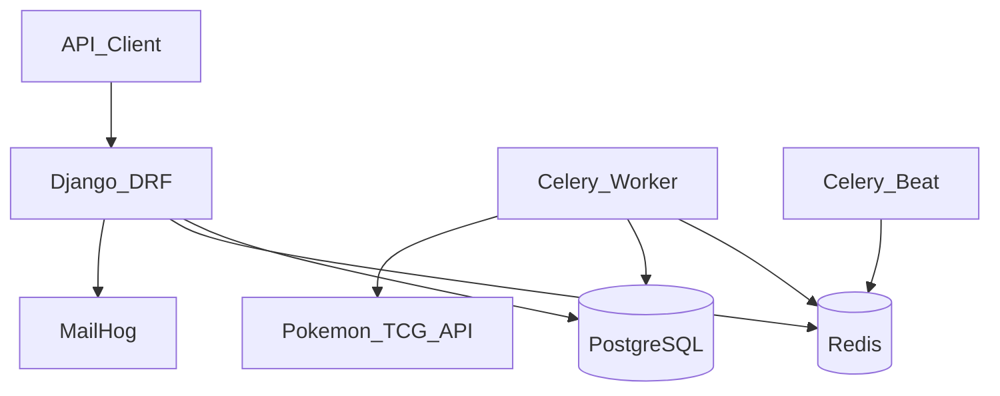

# Poke Chaser API

**Django REST API for tracking Pokémon TCG collections, portfolio value, and virtual binders.**

Django 5 · DRF · PostgreSQL · Redis · Celery · Docker

---

## Overview

Poke Chaser is a backend API that powers a Pokémon Trading Card Game collection tracker. It syncs the full card catalog from the [Pokemon TCG API](https://docs.pokemontcg.io), stores it in PostgreSQL, and exposes a session-authenticated REST API for users to manage collections, track purchase history, and organize cards in virtual binder pages.

The catalog sync runs automatically via Celery every day at midnight UTC, with a management command available for manual backfills. Market values are derived from TCGPlayer pricing data embedded in each card record, and collections expose computed fields for total market value, amount spent, and gain/loss on tracked purchases.

Authentication uses Django sessions with CSRF protection, Argon2 password hashing, scoped rate limiting on sensitive endpoints, and a password-reset flow backed by HTML/text email templates. All user-owned resources are scoped to the authenticated user — collections and binders are never shared across accounts.

---

## Features

### Cards
- Read-only catalog of sets and cards synced from the Pokemon TCG API
- Search and sort on list endpoints
- Paginated responses with a consistent custom shape across the API

### Collections
- Multiple collections per user with a protected default collection
- Quantity tracking per card with optional purchase history (date and price)
- Computed market value, total spent, purchased market value, and gain/loss
- Nested items on collection detail; dedicated items and card-picker endpoints

### Binders
- Virtual binder pages with configurable grid sizes (2×2, 3×3, 3×4, 4×4)
- Place cards in numbered slots; resize triggers overflow into new pages

### Auth
- Register, login, logout, and current-user profile
- Password reset request and confirm (email via MailHog in development)
- Throttled login, registration, and password-reset endpoints

### Operations
- Celery worker and beat for background tasks
- MailHog for local email inspection
- Full Docker Compose stack for one-command development

---

## Tech Stack

| Layer | Technology |
|-------|------------|
| Framework | Django 5, Django REST Framework |
| Database | PostgreSQL 15 |
| Task queue | Celery 5, Redis |
| Auth & security | Session auth, Argon2, CORS, scoped throttling |
| Email | SMTP (MailHog in dev) |
| Infrastructure | Docker Compose |

**Services:** `app` (Django), `worker` (Celery), `beat` (Celery scheduler), `postgres`, `redis`, `mailhog`

---

## Architecture



---

## API Overview

Base URL: `http://localhost:8000`

### Auth

| Method | Endpoint | Description |
|--------|----------|-------------|
| GET | `/auth/csrf/` | Set CSRF cookie |
| POST | `/auth/register/` | Create account |
| POST | `/auth/login/` | Start session |
| POST | `/auth/logout/` | End session |
| GET | `/auth/me/` | Current user |
| POST | `/auth/password-reset/` | Request reset email |
| POST | `/auth/password-reset/confirm/` | Set new password |

### Cards (public)

| Method | Endpoint | Description |
|--------|----------|-------------|
| GET | `/cards/cardSet/` | List sets (`?sort=`) |
| GET | `/cards/cardSet/{id}/` | Set detail |
| GET | `/cards/cardSet/{id}/cards/` | Cards in set (`?search=` `?sort=`) |
| GET | `/cards/card/` | List all cards (`?search=` `?sort=`) |
| GET | `/cards/card/{id}/` | Card detail |

**Set sort:** `release_date_desc` (default), `release_date_asc`, `name_asc`, `name_desc`  
**Card sort:** `number_asc` (default), `number_desc`, `name_asc`, `name_desc`, `price_desc`, `price_asc`

### Collections (auth required)

| Method | Endpoint | Description |
|--------|----------|-------------|
| GET, POST | `/collections/` | List or create collections |
| GET, PATCH, DELETE | `/collections/{id}/` | Detail (includes `items[]`), update, delete |
| GET, POST | `/collections/{id}/items/` | List or add items (`?sort=`) |
| PATCH, DELETE | `/collections/{id}/items/{item_id}/` | Update or remove item |
| POST | `/collections/{id}/items/{item_id}/purchases/` | Add purchase record |
| PATCH, DELETE | `/collections/{id}/items/{item_id}/purchases/{pk}/` | Update or remove purchase |
| GET | `/collections/{id}/cards/` | Card picker view (`?search=` `?sort=`) |

### Binders (auth required)

| Method | Endpoint | Description |
|--------|----------|-------------|
| GET | `/binders/sizes/` | Allowed grid sizes |
| GET, POST | `/binders/` | List or create binders |
| GET, PATCH, DELETE | `/binders/{id}/` | Detail, resize, delete |
| GET, POST | `/binders/{id}/pages/` | List or create pages |
| GET, PATCH, DELETE | `/binders/{id}/pages/{page_id}/` | Page detail |
| PUT, DELETE | `/binders/{id}/pages/{page_id}/slots/{position}/` | Place or clear a card |

### Pagination

List endpoints return a custom paginated shape (not DRF's default):

```json
{
  "links": {
    "first": "http://localhost:8000/cards/card/?page=1",
    "last": "http://localhost:8000/cards/card/?page=10",
    "next": "http://localhost:8000/cards/card/?page=2",
    "prev": null
  },
  "meta": {
    "pagination": {
      "page": 1,
      "pages": 10,
      "count": 240
    }
  },
  "results": []
}
```

Page sizes: sets 18, cards 24, collection items 24.

---

## Getting Started

### Prerequisites

- [Docker Desktop](https://www.docker.com/products/docker-desktop/)

### 1. Environment

```bash
cp .env.example .env
```

Set `POKEMON_TCG_API_KEY` in `.env` for reliable catalog sync ([get a free key](https://dev.pokemontcg.io)). Other variables have sensible defaults for local development.

### 2. First-time setup

```bash
./bin/setup
```

Builds images, runs migrations, and prompts for a Django superuser. Migrations are not run automatically on `./bin/start` — use `./bin/setup` or `./bin/migrate` when the schema changes.

### 3. Start services

```bash
./bin/start
```

| Service | URL |
|---------|-----|
| API | http://localhost:8000 |
| Django admin | http://localhost:8000/admin/ |
| MailHog (email UI) | http://localhost:8025 |

Verify containers:

```bash
docker compose ps
```

---

## Development

### Helper scripts

| Script | Purpose |
|--------|---------|
| `./bin/setup` | First-time setup: build, migrate, createsuperuser |
| `./bin/start` | Start all services (`docker compose up`) |
| `./bin/migrate` | Run Django migrations |
| `./bin/rebuild` | Rebuild images and run migrations |
| `./bin/bash` | Shell into the app container |

### Common commands

```bash
# Daily dev
./bin/start

# After model changes
./bin/migrate

# After Dockerfile or requirements changes
./bin/rebuild

# Sync card catalog from Pokemon TCG API
docker compose exec app python manage.py sync_pokemon_cards

# Run test suite (91 tests)
docker compose exec app python manage.py test

# View logs
docker compose logs -f app

# Stop services
docker compose down

# Stop and remove persisted Postgres data
docker compose down -v
```

### Host-only Django (optional)

Run supporting services in Docker but Django on your machine for faster iteration:

```bash
docker compose up postgres redis mailhog worker beat -d
python3 -m venv .venv
source .venv/bin/activate
pip install -r requirements.txt
POSTGRES_HOST=localhost REDIS_HOST=localhost EMAIL_HOST=localhost python manage.py migrate
POSTGRES_HOST=localhost REDIS_HOST=localhost EMAIL_HOST=localhost python manage.py runserver
```

---

## Project Structure

```
poke-chaser-django/
├── bin/                    # Dev helper scripts
├── pokechaser/
│   ├── core/               # Auth, User model, email templates
│   ├── cards/              # CardSet, Card models, API sync, Celery task
│   ├── collections/        # Collections, items, purchases
│   ├── binders/            # Virtual binder pages and slots
│   ├── settings.py
│   ├── celery.py
│   └── urls.py
├── manage.py
├── Dockerfile
├── docker-compose.yml
├── requirements.txt
├── .env.example
└── .env                    # Local secrets (not committed)
```

---

## Environment Variables

| Variable | Description | Default |
|----------|-------------|---------|
| `POSTGRES_DB` | Database name | `poke_chaser` |
| `POSTGRES_USER` | Database user | `postgres` |
| `POSTGRES_PASSWORD` | Database password | `postgres` |
| `POSTGRES_HOST` | DB host (`postgres` in Compose, `localhost` on host) | `postgres` |
| `POSTGRES_PORT` | Database port | `5432` |
| `REDIS_HOST` | Redis host | `redis` |
| `REDIS_PORT` | Redis port | `6379` |
| `EMAIL_HOST` | SMTP host (MailHog in dev) | `mailhog` |
| `EMAIL_PORT` | SMTP port | `1025` |
| `DEFAULT_FROM_EMAIL` | Sender address for transactional email | `noreply@pokechaser.local` |
| `DJANGO_SECRET_KEY` | Django secret key | — |
| `DJANGO_DEBUG` | Enable debug mode | `True` |
| `DJANGO_ALLOWED_HOSTS` | Comma-separated allowed hosts | `localhost,127.0.0.1,app` |
| `FRONTEND_URL` | Base URL for password-reset links | `http://localhost:5173` |
| `POKEMON_TCG_API_KEY` | API key for Pokemon TCG API sync | — |

`CORS_ALLOWED_ORIGINS` and `CSRF_TRUSTED_ORIGINS` default to `http://localhost:5173` when unset.
